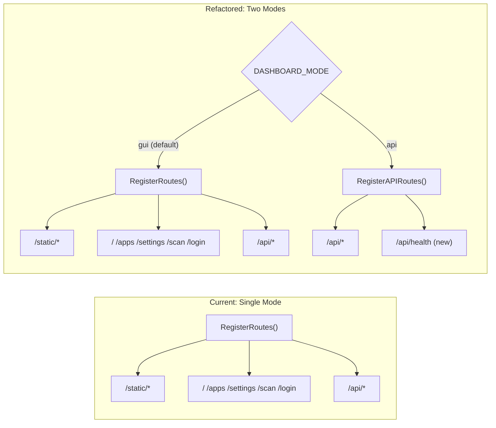

# Dashboard Refactor: API-Only Mode via DASHBOARD_MODE env var

## 1. Objective

Add a `DASHBOARD_MODE` environment variable to the existing dashboard. When set to `api`, the dashboard starts as a **headless REST API** -- no HTML pages, no static assets, no template rendering. When unset or set to `gui` (default), behavior is identical to today.

This is a **runtime toggle**, not a compile-time flag. The same binary supports both modes:

```bash
# Full GUI (current default behavior)
docker run dashboard

# API-only mode
docker run -e DASHBOARD_MODE=api dashboard

# Or via docker-compose
environment:
  - DASHBOARD_MODE=api
```

## 2. What Changes




## 3. Files to Modify

### 3.1. `config/config.go` -- Add Mode field

Add a `Mode` field to `Config` and parse `DASHBOARD_MODE`:

```go
type Config struct {
    Server ServerConfig
    Data   DataConfig
    Auth   AuthConfig
    Stacks StacksConfig
    Import RepoImportConfig
    Mode   string  // "gui" | "api"
}
```

In `Load()`:

```go
Mode: getEnvWithValidation("DASHBOARD_MODE", "gui", []string{"gui", "api"}),
```

New helper (or inline with existing `getEnv`):

```go
func getEnvWithValidation(key, fallback string, valid []string) string {
    value := getEnv(key, fallback)
    for _, v := range valid {
        if value == v {
            return value
        }
    }
    log.Fatalf("Invalid %s=%q, must be one of: %v", key, value, valid)
    return fallback
}
```

Existing file: [config/config.go](e:/_@Go/@GUIDocker/dashboard/config/config.go)

### 3.2. `interfaces/routes.go` -- Split route registration

Split `RegisterRoutes` into two functions:

```go
func RegisterRoutes(mux *http.ServeMux, handler *DashboardHandler) {
    RegisterAPIRoutes(mux, handler)

    mux.Handle("/static/", http.StripPrefix("/static", http.FileServer(http.Dir("static"))))
    mux.HandleFunc("/", handler.Dashboard)
    mux.HandleFunc("/login", handler.Login)
    mux.HandleFunc("/scan", handler.HandleScan)
}

func RegisterAPIRoutes(mux *http.ServeMux, handler *DashboardHandler) {
    mux.HandleFunc("/api/dashboard", handler.APIGetDashboard)
    mux.HandleFunc("/api/apps", handler.APIApps)
    mux.HandleFunc("/api/apps/import", handler.APIImport)
    mux.HandleFunc("/api/apps/", handler.APIAppRoutes)
    mux.HandleFunc("/api/settings", handler.APISettings)
    mux.HandleFunc("/api/certificates/renew", handler.APICertbotRenew)
    mux.HandleFunc("/api/containers/", handler.APIUpdateContainer)
    mux.HandleFunc("/api/scan", handler.APIScan)
    mux.HandleFunc("/api/health", handler.APIHealth)
}
```

Existing file: [routes.go](e:/_@Go/@GUIDocker/dashboard/interfaces/routes.go)

### 3.3. `interfaces/handlers.go` -- Add /api/health endpoint

Add a lightweight health check endpoint that the CLI (and monitoring) can hit:

```go
func (h *DashboardHandler) APIHealth(w http.ResponseWriter, r *http.Request) {
    if r.Method != http.MethodGet {
        writeMethodNotAllowed(w)
        return
    }
    writeJSON(w, http.StatusOK, map[string]string{
        "status": "ok",
        "mode":   os.Getenv("DASHBOARD_MODE"),
    })
}
```

Existing file: [handlers.go](e:/_@Go/@GUIDocker/dashboard/interfaces/handlers.go)

### 3.4. `main.go` -- Conditional startup path

Modify `buildServer` to accept mode and branch on it:

```go
func buildServer(
    cfg *config.Config,
    useCase domain.DashboardUseCase,
    appUseCase domain.AppUseCase,
    scanUseCase domain.ScannerUseCase,
    platformSettingsUseCase domain.PlatformSettingsUseCase,
    auth *middleware.SessionAuth,
    renderer *views.Renderer,       // nil when Mode == "api"
) *http.Server {
    mux := http.NewServeMux()
    handler := interfaces.NewDashboardHandler(useCase, renderer)
    handler.SetAppUseCase(appUseCase)
    handler.SetScanUseCase(scanUseCase)
    handler.SetPlatformSettingsUseCase(platformSettingsUseCase)
    handler.SetCertificateOperations(hosting.NewCertbotManager(), hosting.NewNginxHostManager())

    if cfg.Mode == "api" {
        interfaces.RegisterAPIRoutes(mux, handler)
    } else {
        handler.SetLoginHandler(auth.LoginHandler())
        interfaces.RegisterRoutes(mux, handler)
    }

    next := http.Handler(mux)
    if !cfg.Auth.Disabled {
        next = auth.Middleware()(mux)
    }

    return &http.Server{Addr: cfg.GetServerAddress(), Handler: next}
}
```

In `main()`, skip renderer initialization when in API mode:

```go
var renderer *views.Renderer
if cfg.Mode != "api" {
    var err error
    renderer, err = views.NewRenderer()
    if err != nil {
        log.Fatalf("Failed to initialize view renderer: %v", err)
    }
}
```

And adjust the startup log:

```go
if cfg.Mode == "api" {
    log.Printf("Starting Dashboard Server (API-only mode)...")
    log.Printf("API URL: http://%s/api/", cfg.GetServerAddress())
} else {
    log.Printf("Starting Dashboard Server (GUI mode)...")
    log.Printf("Server URL: http://%s", cfg.GetServerAddress())
    log.Printf("Login page: http://%s/login", cfg.GetServerAddress())
}
```

Existing file: [main.go](e:/_@Go/@GUIDocker/dashboard/main.go)

### 3.5. `interfaces/middleware/auth.go` -- API-mode auth behavior

In API mode, the `/login` HTML route is not registered, so the auth middleware's redirect-to-login branch becomes a 401 for all paths (not just `/api/`). Modify the middleware to accept the mode:

```go
func (a *SessionAuth) Middleware() func(http.Handler) http.Handler {
    return func(next http.Handler) http.Handler {
        return http.HandlerFunc(func(w http.ResponseWriter, r *http.Request) {
            if r.URL.Path == "/login" {
                next.ServeHTTP(w, r)
                return
            }

            if a.hasValidSession(r) {
                next.ServeHTTP(w, r)
                return
            }

            if username, password, ok := r.BasicAuth(); ok && a.validCredentials(username, password) {
                a.setSessionCookie(w)
                next.ServeHTTP(w, r)
                return
            }

            // API mode or /api/ path: always return 401, never redirect
            if a.apiOnly || strings.HasPrefix(r.URL.Path, "/api/") {
                w.Header().Set("WWW-Authenticate", `Basic realm="PaaS"`)
                http.Error(w, "Unauthorized", http.StatusUnauthorized)
                return
            }

            http.Redirect(w, r, "/login", http.StatusSeeOther)
        })
    }
}
```

Add `apiOnly` field to `SessionAuth`:

```go
type SessionAuth struct {
    adminUser string
    adminPass string
    sessions  map[string]time.Time
    mu        sync.Mutex
    apiOnly   bool
}

func NewSessionAuth(user, pass string) *SessionAuth { ... }

func (a *SessionAuth) SetAPIOnly(v bool) { a.apiOnly = v }
```

Existing file: [auth.go](e:/_@Go/@GUIDocker/dashboard/interfaces/middleware/auth.go)

### 3.6. `handlers.go` -- Guard against nil renderer

`DashboardHandler` already receives `renderer` in its constructor. In API mode it will be `nil`. The HTML-serving methods (`Dashboard`, `handleOverview`, etc.) are never registered in API mode, but as a safety net, add an early return in `executeView`:

```go
func (h *DashboardHandler) executeView(w http.ResponseWriter, name string, data interface{}) {
    if h.renderer == nil {
        http.Error(w, "GUI is disabled in API-only mode", http.StatusNotFound)
        return
    }
    // ... existing rendering logic
}
```

Existing file: [handlers.go](e:/_@Go/@GUIDocker/dashboard/interfaces/handlers.go)

## 4. What Does NOT Change

- All `/api/*` endpoints -- identical behavior in both modes
- BoltDB storage -- same buckets, same data, same file
- Docker operations -- same `exec.Command("docker", ...)` calls
- Scanner service -- same logic, just `GET /api/scan` instead of HTML `/scan`
- Basic Auth mechanism -- works the same (401 instead of redirect in API mode)
- Graceful shutdown -- same signal handling

## 5. Docker Compose Usage

```yaml
# docker-compose.yml
services:
  dashboard:
    image: dashboard:latest
    environment:
      - DASHBOARD_MODE=api          # or "gui" (default)
      - PAAS_ADMIN_USER=admin
      - PAAS_ADMIN_PASS=${DASHBOARD_PASS}
      - STACKS_DIR=/opt/stacks
    ports:
      - "127.0.0.1:3000:3000"      # bind to localhost only in API mode
    volumes:
      - /var/run/docker.sock:/var/run/docker.sock
      - /opt/stacks:/opt/stacks
```

Note: in API mode, binding to `127.0.0.1:3000` is recommended -- the port is only accessible via SSH tunnel from the CLI, never exposed to the internet.

## 6. Verification

After the refactor, both modes must pass:

```bash
# GUI mode (existing behavior, regression test)
DASHBOARD_MODE=gui go run .
curl http://localhost:3000/           # 200, HTML
curl http://localhost:3000/api/apps   # 200, JSON (with auth)
curl http://localhost:3000/static/css/app.css  # 200, CSS

# API mode
DASHBOARD_MODE=api go run .
curl http://localhost:3000/           # 404
curl http://localhost:3000/login      # 404
curl http://localhost:3000/static/css/app.css  # 404
curl http://localhost:3000/api/health # 200, {"status":"ok","mode":"api"}
curl -u admin:admin@123 http://localhost:3000/api/apps  # 200, JSON
```

