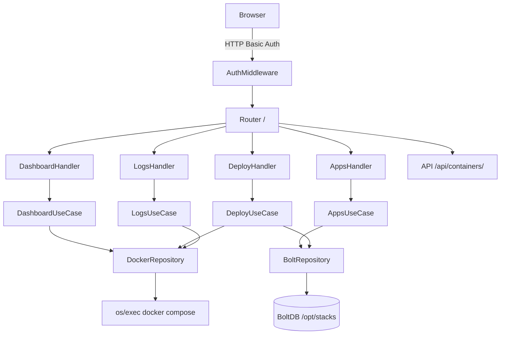
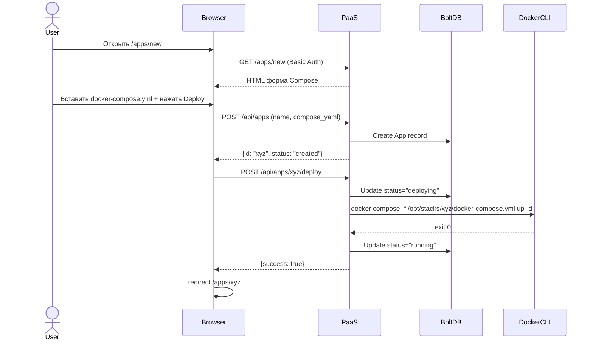

# PaaS MVP Refactor Plan

## Цель

Превратить текущий dashboard (JSON-read-only монолит) в работающий PaaS, который:

- Защищён HTTP Basic Auth (`PAAS_ADMIN_USER` / `PAAS_ADMIN_PASS` из ENV)
- Хранит стеки приложений в BoltDB (`/opt/stacks/`)
- Запускает `docker compose up/down/restart` через `os/exec`
- Отображает статус контейнеров через `docker ps` + `docker compose ps`
- Имеет экраны: Dashboard, Apps, Deploy (Create/Edit Compose), Logs

## Серверные требования (setup инструкция)

Установить на Ubuntu/Debian сервере:

```bash
sudo apt-get update && sudo apt-get install -y docker.io nginx
sudo curl -L "https://github.com/docker/compose/releases/latest/download/docker-compose-$(uname -s)-$(uname -m)" -o /usr/local/bin/docker-compose
sudo chmod +x /usr/local/bin/docker-compose
sudo usermod -aG docker $USER
sudo mkdir -p /opt/stacks
```

Запуск PaaS-сервера:

```bash
PAAS_ADMIN_USER=admin PAAS_ADMIN_PASS=admin@123 PAAS_PORT=3000 ./dashboard
```

## Архитектура (Clean Architecture)




## Новая структура директорий

```
dashboard/
├── cmd/server/main.go          # Entry point (сейчас: dashboard/main.go)
├── domain/
│   ├── app.go                  # NEW: App, Stack entities
│   ├── entities.go             # Существующий Container, DashboardData
│   ├── errors.go
│   ├── repository.go           # NEW: AppRepository, DockerRepository interfaces
│   └── usecases.go             # NEW: AppUseCase, DeployUseCase interfaces
├── infrastructure/
│   ├── bolt/
│   │   └── app_repo.go         # NEW: BoltDB реализация AppRepository
│   ├── docker/
│   │   └── docker_repo.go      # NEW: os/exec docker compose реализация
│   └── repository.go           # Существующий JSON dashboard (оставить для совместимости)
├── usecase/
│   ├── app/app.go              # NEW: создание/редактирование стеков
│   └── deploy/deploy.go        # NEW: deploy/stop/restart/status
├── interfaces/
│   ├── handlers.go             # Существующий + расширить
│   ├── routes.go               # Расширить роуты
│   └── middleware/
│       └── auth.go             # NEW: HTTP Basic Auth
├── config/
│   └── config.go               # Расширить: AdminUser, AdminPass, StacksDir
├── data/
│   └── dashboard.json
└── go.mod                      # Добавить: go.etcd.io/bbolt
```

## Что добавить в go.mod

```
go.etcd.io/bbolt v1.3.x
```

## Детальный план задач

### Задача 1: Расширить config.go

Файл: `[dashboard/config/config.go](dashboard/config/config.go)`

Добавить в `Config`:

```go
Auth AuthConfig
Stacks StacksConfig
```

где:

```go
type AuthConfig struct {
    AdminUser string  // ENV: PAAS_ADMIN_USER, default "admin"
    AdminPass string  // ENV: PAAS_ADMIN_PASS, default "admin@123"
}
type StacksConfig struct {
    Dir string        // ENV: STACKS_DIR, default "/opt/stacks"
    DBFile string     // ENV: BOLT_DB_FILE, default "/opt/stacks/.paas.db"
}
```

### Задача 2: HTTP Basic Auth middleware

Файл: `dashboard/interfaces/middleware/auth.go` (новый)

```go
func BasicAuth(user, pass string) func(http.Handler) http.Handler
```

- Проверяет `Authorization: Basic <base64>` заголовок
- При ошибке: `401 Unauthorized` + форма логина (HTML redirect на `/login`)
- Экран логина `/login` — отдельный HTML (без sidebar, простая форма)
- Cookie `paas_session=<hash>` после успешного логина, валидность 24h (in-memory map)

### Задача 3: domain/app.go — сущность Stack/App

Файл: `dashboard/domain/app.go` (новый)

```go
type App struct {
    ID          string    `json:"id"`
    Name        string    `json:"name"`
    ComposeYAML string    `json:"compose_yaml"`
    Dir         string    `json:"dir"`          // /opt/stacks/{id}/
    Status      string    `json:"status"`       // running/stopped/error
    Ports       []string  `json:"ports"`
    CreatedAt   time.Time `json:"created_at"`
    UpdatedAt   time.Time `json:"updated_at"`
}
```

Интерфейсы в `domain/repository.go`:

```go
type AppRepository interface {
    Create(ctx, *App) error
    Update(ctx, *App) error
    Delete(ctx, id string) error
    GetByID(ctx, id string) (*App, error)
    List(ctx) ([]*App, error)
}

type DockerRepository interface {
    Deploy(ctx, app *App) error
    Stop(ctx, app *App) error
    Restart(ctx, app *App) error
    GetStatus(ctx, app *App) (string, error)
    GetLogs(ctx, appID string, lines int) (string, error)
    ListRunning(ctx) ([]Container, error)
}
```

### Задача 4: BoltDB AppRepository

Файл: `dashboard/infrastructure/bolt/app_repo.go` (новый)

- Bucket `apps`
- Ключ: `app.ID` (UUID)
- Значение: JSON Marshal `App`
- Методы: Create, Update, Delete, GetByID, List

### Задача 5: Docker os/exec Repository

Файл: `dashboard/infrastructure/docker/docker_repo.go` (новый)

```go
// Deploy: записывает compose_yaml в /opt/stacks/{id}/docker-compose.yml
//         запускает: docker compose -f <path> up -d
// Stop: docker compose -f <path> down
// Restart: docker compose -f <path> restart
// GetStatus: docker compose -f <path> ps --format json
// GetLogs: docker compose -f <path> logs --tail=<lines> --no-color
// ListRunning: docker ps --format json
```

### Задача 6: UseCase слой

Файл: `dashboard/usecase/app/app.go` (новый)

```go
type AppUseCase interface {
    CreateApp(ctx, name, composeYAML string) (*domain.App, error)
    UpdateApp(ctx, id, name, composeYAML string) (*domain.App, error)
    DeleteApp(ctx, id string) error
    GetApp(ctx, id string) (*domain.App, error)
    ListApps(ctx) ([]*domain.App, error)
    DeployApp(ctx, id string) error
    StopApp(ctx, id string) error
    RestartApp(ctx, id string) error
    GetAppStatus(ctx, id string) (string, error)
    GetAppLogs(ctx, id string, lines int) (string, error)
}
```

Реализация в `dashboard/usecase/app/service.go`:

- Принимает `AppRepository` и `DockerRepository` (DI)
- При Deploy: валидация YAML (не пустой) → `AppRepository.Update(status="deploying")` → `DockerRepository.Deploy` → обновить статус

### Задача 7: Новые API роуты

Файл: `[dashboard/interfaces/routes.go](dashboard/interfaces/routes.go)`

```go
// Новые роуты:
mux.HandleFunc("/login", handler.Login)
mux.HandleFunc("/api/apps", handler.APIApps)           // GET list, POST create
mux.HandleFunc("/api/apps/", handler.APIAppDetail)     // GET, PUT update, DELETE
mux.HandleFunc("/api/apps/{id}/deploy", handler.APIDeploy)   // POST
mux.HandleFunc("/api/apps/{id}/stop", handler.APIStop)       // POST
mux.HandleFunc("/api/apps/{id}/restart", handler.APIRestart) // POST
mux.HandleFunc("/api/apps/{id}/logs", handler.APILogs)       // GET
```

### Задача 8: UI экраны (handlers.go)

Файл: `[dashboard/interfaces/handlers.go](dashboard/interfaces/handlers.go)`

Уже есть: `renderComposeScreen`, `renderAppLogs`, `renderAppDetail`

Доработать:

- Форма `renderComposeScreen`: Save сохраняет в BoltDB через `POST /api/apps`, Deploy вызывает `POST /api/apps/{id}/deploy`
- Логи `renderAppLogs`: вызывает `GET /api/apps/{id}/logs?lines=100` через JS fetch
- Кнопки Start/Stop/Restart на экране деталей приложения — вызывают новые API endpoints
- Статус приложения отображается как бейдж (running/stopped/error/deploying)

### Задача 9: TDD тесты

По паттерну существующих `handlers_test.go`:

- `dashboard/usecase/app/service_test.go` — мок AppRepository + DockerRepository, тесты: CreateApp, DeployApp (успех/ошибка), StopApp
- `dashboard/infrastructure/bolt/app_repo_test.go` — тесты с реальным BoltDB в temp-файле
- `dashboard/interfaces/handlers_test.go` — добавить: TestLoginScreen, TestAPIApps_Create, TestAPIDeploy_Success

### Задача 10: main.go wiring

Файл: `dashboard/main.go`

```go
bolt := bolt.NewAppRepository(cfg.Stacks.DBFile)
dockerRepo := docker.NewDockerRepository(cfg.Stacks.Dir)
appUseCase := app.NewAppService(bolt, dockerRepo)

handler := interfaces.NewDashboardHandler(dashboardUseCase, appUseCase)
mux := http.NewServeMux()
interfaces.RegisterRoutes(mux, handler)

authMux := middleware.BasicAuth(cfg.Auth.AdminUser, cfg.Auth.AdminPass)(mux)
server := &http.Server{Addr: cfg.GetServerAddress(), Handler: authMux}
```

### Задача 11: Systemd unit + nginx config (документация)

Файл: `dashboard/README.md` — добавить секцию Production Setup:

```ini
# /etc/systemd/system/paas.service
[Service]
Environment=PAAS_ADMIN_USER=admin
Environment=PAAS_ADMIN_PASS=admin@123
Environment=STACKS_DIR=/opt/stacks
ExecStart=/usr/local/bin/paas
```

```nginx
# /etc/nginx/sites-enabled/paas
server {
    listen 80;
    location / { proxy_pass http://127.0.0.1:3000; }
}
```

## Деплой Flow (итог)




## Что НЕ входит в MVP

- Nginx auto-config / SSL / Let's Encrypt (Phase 2)
- Метрики CPU/Memory в реальном времени через Docker SDK (Phase 2)
- CRON cleanup / wildcard domains (Phase 3)
- Multi-user / RBAC (Phase 4)

