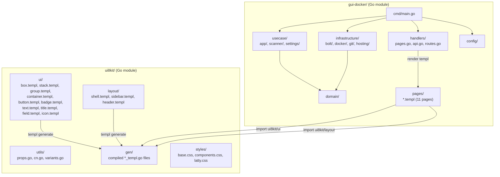

# ui8kit Monorepo + gui-docker Migration Plan

## Architecture




## Directory Structure

```
(repo root)
├── dashboard/          # EXISTING - untouched until Phase 5
├── ui8kit/             # NEW - headless component library
│   ├── go.mod          # module ui8kit
│   ├── utils/
│   │   ├── props.go    # UtilityProps struct + Resolve()
│   │   ├── cn.go       # cn() class joiner
│   │   └── variants.go # ButtonVariant, BadgeVariant, TypographyVariant, FieldVariant, CardVariant
│   ├── ui/
│   │   ├── box.templ
│   │   ├── stack.templ
│   │   ├── group.templ
│   │   ├── container.templ
│   │   ├── block.templ
│   │   ├── button.templ
│   │   ├── badge.templ
│   │   ├── text.templ
│   │   ├── title.templ
│   │   ├── field.templ
│   │   └── icon.templ
│   ├── layout/
│   │   ├── shell.templ       # full page layout (sidebar + header + main)
│   │   ├── sidebar.templ     # nav rendering with active state
│   │   └── header.templ      # top bar with mobile hamburger + theme toggle
│   └── styles/
│       ├── base.css          # CSS variables, reset, dark mode tokens
│       ├── components.css    # @apply semantic classes (card, app-row, etc.)
│       └── latty.css         # lucide icon mask sprites (from dashboard/static/css/latty.css)
│
├── gui-docker/         # NEW - Docker panel (replaces dashboard/)
│   ├── go.mod          # module gui-docker; require ui8kit (replace ../ui8kit)
│   ├── cmd/
│   │   └── main.go     # composition root (mirrors dashboard/main.go)
│   ├── config/
│   │   └── config.go   # copied from dashboard/config/
│   ├── domain/
│   │   ├── app.go
│   │   ├── entities.go
│   │   ├── errors.go
│   │   ├── platform_settings.go
│   │   ├── repository.go
│   │   ├── scan.go
│   │   └── usecases.go
│   ├── infrastructure/
│   │   ├── bolt/           # copied from dashboard/infrastructure/bolt/
│   │   ├── docker/         # copied from dashboard/infrastructure/docker/
│   │   ├── git/            # copied from dashboard/infrastructure/git/
│   │   ├── hosting/        # copied from dashboard/infrastructure/hosting/
│   │   ├── repository.go   # DashboardRepository (JSON)
│   │   └── localdeps/      # bbolt local replacement
│   ├── usecase/
│   │   ├── app/            # copied from dashboard/usecase/app/
│   │   ├── scanner/        # copied from dashboard/usecase/scanner/
│   │   └── settings/       # copied from dashboard/usecase/settings/
│   ├── pages/              # NEW templ pages (replaces dashboard/views/)
│   │   ├── overview.templ
│   │   ├── apps.templ
│   │   ├── app_detail.templ
│   │   ├── app_detail_paas.templ
│   │   ├── compose.templ
│   │   ├── compose_container.templ
│   │   ├── logs.templ
│   │   ├── logs_container.templ
│   │   ├── settings.templ
│   │   ├── scan.templ
│   │   ├── login.templ
│   │   ├── viewmodels.go   # all view model structs
│   │   └── helpers.go      # template funcs (join, time format, status->class)
│   ├── handlers/
│   │   ├── pages.go        # page handlers (render templ components)
│   │   ├── api.go          # JSON API handlers (from paas_handlers.go)
│   │   ├── scan.go         # scan handlers
│   │   └── routes.go       # RegisterRoutes
│   ├── middleware/
│   │   └── auth.go         # session auth
│   ├── static/
│   │   └── css/
│   │       └── app.css     # compiled Tailwind output
│   └── scripts/
│       └── build-css.sh    # tailwindcss -i ... -o ...
```

## Phases

### Phase 0: Scaffold (Session 1)

**Goal:** Empty mono-repo skeleton compiles and serves a hello-world templ page.

- Create `ui8kit/go.mod` with `github.com/a-h/templ` dependency
- Create `gui-docker/go.mod` with `replace ../ui8kit` directive and `github.com/a-h/templ` dependency
- Create `ui8kit/utils/cn.go` — `func Cn(classes ...string) string` (join non-empty strings with space)
- Create minimal `ui8kit/ui/box.templ` with just a `div` wrapper
- Create minimal `ui8kit/layout/shell.templ` with hardcoded sidebar HTML
- Create `gui-docker/cmd/main.go` — `http.ListenAndServe` serving one page that renders shell
- Run `templ generate` in both modules, verify compilation
- Set up Tailwind CSS build: create `gui-docker/static/css/input.css` with `@import "tailwindcss"` and `@source` pointing to `../../ui8kit/**/*.templ` and `../pages/**/*.templ`
- Copy `dashboard/static/css/latty.css` to `ui8kit/styles/latty.css`
- Verify: browser shows shell layout at `localhost:8080`

**Test:** `go build ./cmd/...` succeeds; `templ generate` produces `*_templ.go` in expected locations.

---

### Phase 1: ui8kit Primitives (Session 2)

**Goal:** All UI primitives work with props-based API.

#### 1a. Utils core

`ui8kit/utils/props.go`:

- `UtilityProps` struct with ~30 string fields: `Flex`, `Gap`, `Items`, `Justify`, `P`, `Px`, `Py`, `Pt`, `Pb`, `Pl`, `Pr`, `M`, `Mt`, `Mb`, `Ml`, `Mr`, `Mx`, `My`, `W`, `H`, `MinW`, `MaxW`, `Rounded`, `Shadow`, `Border`, `Bg`, `Text`, `Font`, `Leading`, `Tracking`, `Overflow`, `Z`, `Hidden` (bool), `Truncate` (bool), `Grid`, `Col`, `Row`, `Order`, `Grow`, `Shrink`, `Basis`
- `func (u UtilityProps) Resolve() string` — resolve each field to Tailwind class tokens, handling special cases: `Flex="col"` -> `"flex flex-col"`, `Gap` semantic aliases (xs/sm/md/lg/xl -> 1/2/4/6/8), bool fields (Hidden -> "hidden", Truncate -> "truncate")

`ui8kit/utils/variants.go`:

- `func ButtonStyleVariant(variant string) string` — base classes + variant switch (default/primary, destructive, outline, secondary, ghost, link). Base: `"inline-flex items-center justify-center gap-2 whitespace-nowrap text-sm font-medium rounded transition-colors shrink-0 outline-none"`
- `func ButtonSizeVariant(size string) string` — xs/sm/default/md/lg/xl/icon
- `func BadgeStyleVariant(variant string) string` — base + variant switch (default, secondary, destructive, outline, success, warning, info)
- `func BadgeSizeVariant(size string) string` — xs/sm/default/lg
- `func TypographyClasses(fontSize, fontWeight, lineHeight, letterSpacing, textColor, textAlign string, truncate bool) string`
- `func FieldVariant(variant string) string` — default/outline/ghost
- `func FieldSizeVariant(size string) string`
- `func StatusBadgeClass(status string) string` — running->primary, stopped->muted, paused->accent, created->muted, deploying->accent, error->destructive

**Test:** Unit tests for `Resolve()` and each variant function in `utils/props_test.go` and `utils/variants_test.go`. Cover: empty props -> empty string; single field; multiple fields; flex direction special case; gap semantic aliases; all variant values produce non-empty classes.

#### 1b. Layout primitives

`ui8kit/ui/box.templ` — `BoxProps{UtilityProps, Class, Tag}`, renders `<div>` (or custom tag) with `cn(props.Resolve(), class)`
`ui8kit/ui/stack.templ` — `StackProps{UtilityProps, Class, Tag}`, defaults: `flex flex-col gap-4 items-start justify-start`
`ui8kit/ui/group.templ` — `GroupProps{UtilityProps, Class, Tag, Grow bool}`, defaults: `flex gap-4 items-center justify-start min-w-0`
`ui8kit/ui/container.templ` — `ContainerProps{UtilityProps, Class}`, defaults: `max-w-7xl mx-auto px-4`
`ui8kit/ui/block.templ` — `BlockProps{UtilityProps, Class, Tag}`, bare wrapper (same as Box, alias)

#### 1c. Widget primitives

`ui8kit/ui/button.templ` — `ButtonProps{UtilityProps, Variant, Size, Href, Class, Type, Disabled, OnClick}`, polymorphic `<a>` / `<button>`
`ui8kit/ui/badge.templ` — `BadgeProps{UtilityProps, Variant, Size, Class}`
`ui8kit/ui/text.templ` — `TextProps{UtilityProps, Class, Tag, FontSize, FontWeight, LineHeight, LetterSpacing, TextColor, TextAlign, Truncate}`
`ui8kit/ui/title.templ` — `TitleProps{UtilityProps, Class, Order(1-6), FontSize, FontWeight, LineHeight, LetterSpacing, TextColor, TextAlign, Truncate}`
`ui8kit/ui/field.templ` — `FieldProps{UtilityProps, Class, Variant, Size, Type, Name, ID, Placeholder, Value, Rows, Min, Max, Checked, Disabled}`, renders `<input>` / `<textarea>` / `<select>` based on `Component` field
`ui8kit/ui/icon.templ` — `IconProps{Name, Size, Class}`, renders `<span class="latty latty-{name} {sizeClass}">` with size variants (xs=h-3 w-3, sm=h-4 w-4, md=h-5 w-5, lg=h-6 w-6)

**Test:** Compile test — `templ generate && go build ./...` in ui8kit.

---

### Phase 2: Layout Shell (Session 3)

**Goal:** Full layout 1:1 with current `layout.html`.

`ui8kit/layout/shell.templ`:

- `ShellProps{Title, Active string, NavItems []NavItem}` where `NavItem{Path, Label, Icon string}`
- Renders: `<html>` with dark-mode script, `<head>` with meta + CSS link + favicon, `<body>` with mobile sidebar backdrop, mobile sidebar with nav, desktop sidebar with nav, header with hamburger + title + theme toggle, `<main>` slot for children
- Inline `<script>` blocks for: `openMobileSidebar`, `closeMobileSidebar`, escape key, swipe-to-close, `showComposeMessage`, `updateContainerStatus`

`ui8kit/layout/sidebar.templ`:

- `SidebarProps{Items []NavItem, Active string, Mobile bool}`
- Renders nav links with active state styling (matches current `nav.html` partial)

`ui8kit/layout/header.templ`:

- `HeaderProps{Title string}`
- Renders hamburger button + title + theme toggle

`ui8kit/styles/base.css`:

- CSS variables for light/dark tokens (from current `input.css`)
- `@custom-variant dark (&:where(.dark, .dark *))`
- `.dashboard-lucide-icon` dark mode filter

`ui8kit/styles/components.css`:

- `@apply`-based semantic classes: `.card`, `.card-header`, `.card-title`, `.card-content`, `.status-badge`, `.app-row`, `.form-label`, `.form-input`

**Test:** Visual — render shell with dummy nav items, verify sidebar, header, mobile drawer, theme toggle all work in browser. Structural — `go build` + `templ generate` succeed.

---

### Phase 3: gui-docker Pages (Sessions 4-6)

**Goal:** All 11 page templates recreated as templ components using ui8kit.

Each page is a templ function that accepts a typed view model and composes ui8kit primitives.

#### Session 4: List + Overview pages

`gui-docker/pages/viewmodels.go` — all view model structs (mirrors [dashboard/views/renderer.go](dashboard/views/renderer.go) view types):

- `LayoutData{Title, Subtitle, Active string}`
- `ContainerView{ID, Name, Image, Status, PortsStr, CPUPercent, MemoryMB string}`
- `AppListItem{ID, Name, Status string}`
- `OverviewData{Layout LayoutData, Stats StatsData, Containers []ContainerView}`
- `StatsData{TotalContainers, RunningContainers, StoppedContainers, PausedContainers int}`
- `AppsData{Layout LayoutData, Items []AppListItem}`

`gui-docker/pages/overview.templ` — stats cards grid + containers table (from `overview.html` + `stats_cards.html` + `containers_table.html` + `container_row.html` + `container_actions.html`)
`gui-docker/pages/apps.templ` — app list with status badges + "Create app" link (from `apps.html`)

#### Session 5: Detail + Logs pages

`gui-docker/pages/app_detail.templ` — container detail (from `app_detail.html`)
`gui-docker/pages/app_detail_paas.templ` — PaaS detail with config form, actions, inline JS for `runAppAction`, `deleteApp`, `loadAppConfig`, `saveAppConfig` (from `app_detail_paas.html`)
`gui-docker/pages/logs.templ` — PaaS logs with refresh (from `logs.html`)
`gui-docker/pages/logs_container.templ` — container logs (from `logs_container.html`)

#### Session 6: Compose + Settings + Scan + Login pages

`gui-docker/pages/compose.templ` — tabbed compose/import form with inline JS (from `compose.html`)
`gui-docker/pages/compose_container.templ` — container compose editor (from `compose_container.html`)
`gui-docker/pages/settings.templ` — admin settings + certbot settings form with inline JS (from `settings.html`)
`gui-docker/pages/scan.templ` — scan results table with expandable rows, cleanup commands, copy button (from `scan.html`)
`gui-docker/pages/login.templ` — simple login form (from inline HTML in `Login` handler)

`gui-docker/pages/helpers.go`:

- `func JoinStrings(items []string, sep string) string`
- `func TimeLayout() string` — returns `"2006-01-02 15:04:05"`
- `func StatusClass(status string) string` — delegates to `utils.StatusBadgeClass`

**Test:** `templ generate && go build ./...` succeeds for gui-docker. Each page compiles with its view model.

---

### Phase 4: Backend Wiring (Sessions 7-8)

**Goal:** All business logic ported, API works identically.

#### Session 7: Domain + Infrastructure

- Copy `dashboard/domain/` to `gui-docker/domain/` — update module path in imports
- Copy `dashboard/infrastructure/` to `gui-docker/infrastructure/` — update module path
- Copy `dashboard/config/` to `gui-docker/config/` — update module path
- Copy `dashboard/localdeps/` to `gui-docker/localdeps/`
- Copy `dashboard/usecase/` to `gui-docker/usecase/` — update module path
- Copy `dashboard/interfaces/middleware/` to `gui-docker/middleware/`
- Update `gui-docker/go.mod` with all dependencies: `go.etcd.io/bbolt`, `gopkg.in/yaml.v3`, the `replace` directive for local bbolt

Key adaptation: handlers no longer call `renderer.Execute("template_name", data)`. Instead they call `templ.Handler(pages.AppsPage(viewModel)).ServeHTTP(w, r)` or use the `pages.X(data).Render(ctx, w)` pattern.

#### Session 8: Handlers + Routes + Main

`gui-docker/handlers/pages.go`:

- `DashboardHandler` struct with same fields as current: `useCase`, `appUseCase`, `scanUseCase`, `platformSettingsUseCase`
- Each page handler builds view model and calls `component.Render(r.Context(), w)` where component is a templ function from `pages/`
- `handleOverview`, `handleApps`, `handleAppDetail`, `handleComposeCreate`, `handleComposeEdit`, `handleAppLogs`, `handleSettings` — same routing logic as current [dashboard/interfaces/handlers.go](dashboard/interfaces/handlers.go)

`gui-docker/handlers/api.go`:

- All JSON API handlers copied from [dashboard/interfaces/paas_handlers.go](dashboard/interfaces/paas_handlers.go) — these are pure JSON, no template changes needed

`gui-docker/handlers/scan.go`:

- `HandleScan`, `APIScan` from [dashboard/interfaces/scan_handlers.go](dashboard/interfaces/scan_handlers.go)

`gui-docker/handlers/routes.go`:

- `RegisterRoutes` — same routes as [dashboard/interfaces/routes.go](dashboard/interfaces/routes.go)

`gui-docker/cmd/main.go`:

- Same composition flow as [dashboard/main.go](dashboard/main.go): load config, create repos, create services, create handler, register routes, start server
- Static file serving: `/static/` serves from `gui-docker/static/`
- CSS build: Tailwind CLI reads `input.css` with `@source` for both `ui8kit/` and `gui-docker/pages/`

**Test:** 

- `go build ./cmd/...` succeeds
- Unit tests from `dashboard/usecase/app/service_test.go` and `dashboard/interfaces/handlers_test.go` adapted to new module paths — must pass
- Manual: start server, verify every page renders, every API endpoint responds correctly

---

### Phase 5: Verification + Cleanup (Session 9)

**Goal:** Confirm 1:1 parity, remove old dashboard/.

Verification checklist:

- All 11 pages render with correct layout, sidebar, header
- Dark mode toggle works
- Mobile sidebar opens/closes (hamburger, backdrop, swipe, Escape)
- `/` overview: stats cards + containers table + actions
- `/apps` list: items with status badges, empty state
- `/apps/new` compose: tab switching, create app, import repo
- `/apps/:id` detail: PaaS vs container mode, config form, deploy/restart/stop/delete actions
- `/apps/:id/compose` edit: load existing compose, save
- `/apps/:id/logs`: load + refresh logs
- `/settings`: load/save admin settings, certbot settings, renew certificates
- `/scan`: run scan, expandable rows, copy cleanup commands
- `/login`: form renders, auth works
- All API endpoints return correct JSON
- CSS: Tailwind output matches current visual appearance

After verification:

- Remove `dashboard/` directory
- Update any CI/build scripts
- Update README

**Test:** Run adapted test suite. Browser-agent visual verification of every screen.

## Key Decisions

- **templ generate output** goes into the same package directory as the `.templ` files (standard templ behavior), not into a separate `gen/` — templ generates `*_templ.go` files alongside `.templ` files. The `gen/` directory idea is dropped in favor of templ's standard convention.
- **No `html/template` anywhere** — all rendering is templ. Inline `<script>` blocks stay in templ files using `@templ.Raw()` or `<script>` tags.
- **Business logic is copied as-is** — domain/, usecase/, infrastructure/ change only import paths. Zero refactoring.
- **Static CSS build** uses Tailwind CLI v4 with `@source` directives pointing to both `ui8kit/` and `gui-docker/pages/`.
- **The VM has no Docker** — all docker adapter code compiles but will use mock mode (`DASHBOARD_DEV_MODE=true`). The browser agent verifies UI/UX only.

